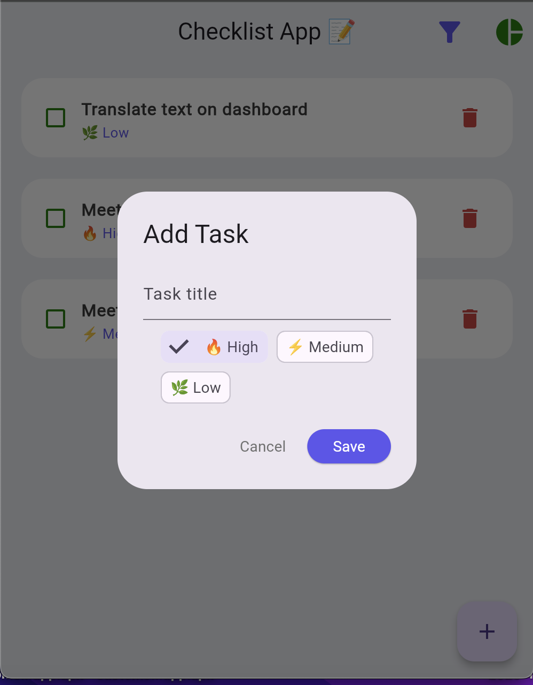

# checklist_app

A new Flutter project.

## Getting Started
Check list app create for assignment:

-> The app should allow users to create, edit, and delete to-do items.

-> The app should let users set priorities and do sortable.

->The app should also allow users to mark check-list items as completed.

-> The app should also allow users to preview personal dashboard (on graph).

## Start project
-> cd checklist_app

-> This project i use to run it on web server because my cumputer can not run latest version of flutter.

### flutter run on web
-> flutter run -d web-server --web-port=8080 --web-hostname=0.0.0.0

